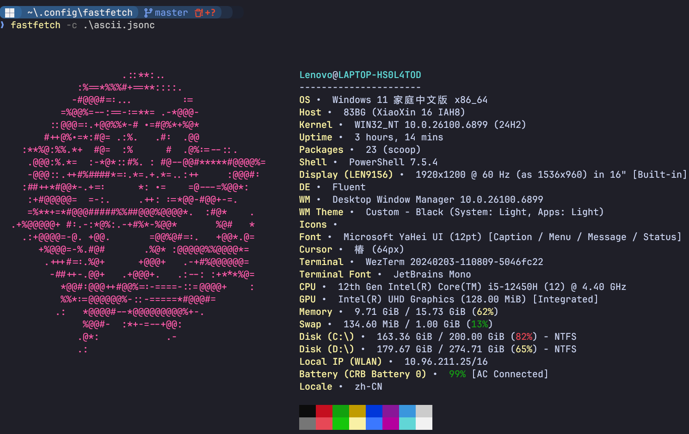
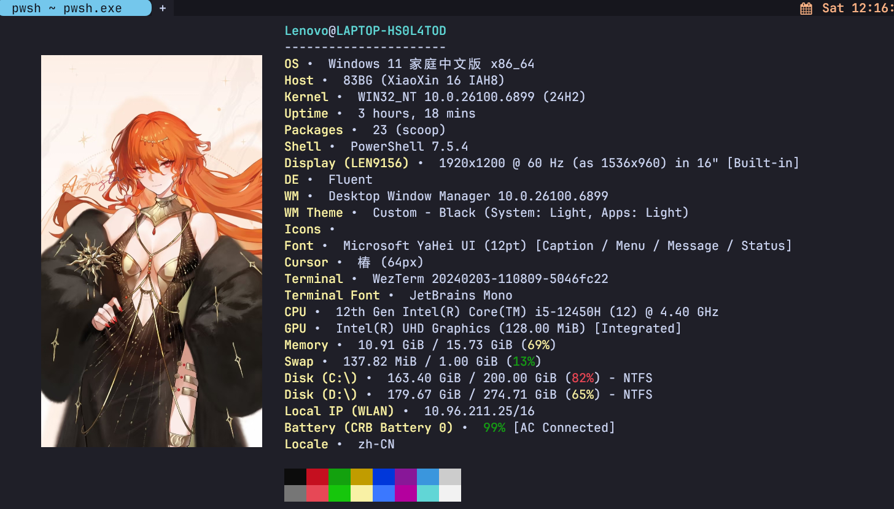

# 🎨 FastFetch Dynamic Logo Theme Pack

✨ 为 [FastFetch](https://github.com/LinusBorg/fastfetch) 打造的**动态 Logo 主题包**，支持随机切换静态图、GIF、WebP 动画，适用于 Windows + WezTerm + PowerShell 环境。

> 🌟 每次打开终端，都有新鲜感！
---

## ✨ 特性：
- 支持 PNG、JPG、GIF、WebP 格式
- 附带多种风格配置（ASCII、图像、动图）
- 由**ff.ps1**脚本提供
	- 每次启动随机显示不同 Logo
	- 可指定特定 Logo 显示
	- 支持自定义宽度

## 🚀 快速启动脚本 `ff.ps1`

通过 PowerShell 脚本封装，实现一键调用、随机切换 Logo：
```powershell
ff                  # 随机显示一个 logo
ff -name teresa.gif # 显示指定 logo
ff -width 40        # 设置 logo 宽度
ff -list            # 查看所有可用 logo
ff -help            # 查看帮助
```

---

## 🖼️ 预览效果

| 配置                          | 效果描述                | 预览图                          |
| --------------------------- | ------------------- | ---------------------------- |
| `ascii.jsonc` + `ascii.txt` | 使用 ASCII 艺术字作为 Logo |   |
| `gif.jsonc` + `kiana.webp`  | WebP 动画 Logo（推荐动效）  |  |
| `img.jsonc` + `augusta.png` | 静态图片 Logo（简洁稳定）     |     |

### 注意
- 💡 **终端支持**：GIF/WebP 动画效果需终端支持透明背景和动画渲染，推荐使用 [WezTerm](https://wezfurlong.org/wezterm/)。

-  ⚠️ **配置加载**: FastFetch 默认只读取 `config.jsonc`，其他配置需通过 `fastfetch -c ~/.config/fastfetch/xxx.jsonc` 指定。
- 加载ff.ps1脚本,执行**ff**命令可以随机获取上面预览效果

---

## ⚙️ 配置文件说明

| 文件             | 作用                    |
| -------------- | --------------------- |
| `config.jsonc` | 默认配置（webp Logo）       |
| `img.jsonc`    | 使用静态图片作为 Logo         |
| `gif.jsonc`    | 使用动图（GIF/WebP）作为 Logo |
| `ascii.jsonc`  | 使用 ASCII 艺术字作为 Logo   |

---

## 🐱‍💻 使用方法

### 1. 安装依赖
确保已安装：
- [fastfetch](https://github.com/LinusBorg/fastfetch)
- PowerShell 5.1+
- [WezTerm（推荐， 可以参考我的配置）](https://github.com/Klein-3000/wezterm)

### 2. 安装配置
```powershell
# 克隆仓库
git clone https://github.com/Klein-3000/fastfetch.git
# 复制到配置目录
Copy-Item -Recurse fastfetch-config\* -Destination "$env:USERPROFILE\.config\fastfetch"
```


### 3. 注册 ff.ps1 到环境变量（可选）

为了让 `ff` 命令全局可用，可将脚本目录加入 PowerShell 的 `$PROFILE`：

```powershell
# 编辑你的 PowerShell 配置文件
notepad $PROFILE

# 在文件末尾添加：
$env:PATH += ";$env:USERPROFILE\.config\fastfetch"
```
## 📂 Logo 资源

所有 Logo 存放于 `%USERPROFILE%\.config\fastfetch\logos\` 目录，支持格式：

- `.png`, `.jpg`, `.jpeg`
- `.gif`（动图）
- `.webp`（动图）

你可以自由添加新图片！运行 `ff -list` 可查看当前可用 Logo。

---


## 📄 版权与免责声明

本仓库中的部分图像素材来源于游戏《崩坏3》等二游及相关二次创作内容，版权归原作者所有。

本项目为个人非商业性质的开源爱好者项目，旨在分享终端美化配置，不涉及任何盈利行为。若涉及版权问题，请联系作者删除相关内容。

📌 请遵守相关法律法规，勿将本项目用于商业用途或未经授权的分发。

❤️ 如果你喜欢这个项目，欢迎点个 Star 支持！
